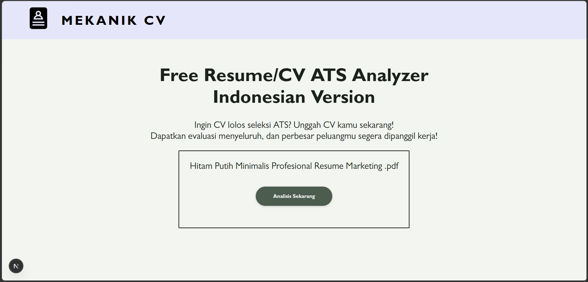
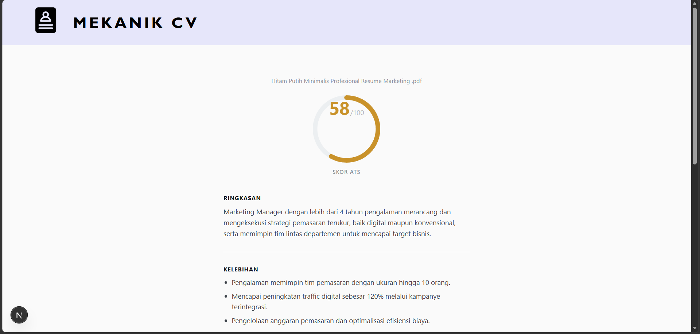

# Mekanik CV - Resume/CV ATS Analyzer

Mekanik CV adalah aplikasi **Resume/CV ATS Analyzer** untuk mengevaluasi CV berbahasa Indonesia berdasarkan kriteria umum Applicant Tracking System (ATS).

Aplikasi ini memungkinkan pengguna mengunggah CV dalam format PDF, kemudian sistem mengekstrak teks, mendeteksi bahasa CV, dan menggunakan LLM untuk menghasilkan **skor ATS, ringkasan profil, skill yang masih kurang, kelebihan, kekurangan, serta saran perbaikan**.

Frontend aplikasi dibuat menggunakan **Next.js**, sedangkan proses analisis CV dijalankan oleh **FastAPI** dan model LLM dari **Groq**.

> **Catatan:** skor ATS merupakan hasil evaluasi berbasis aturan/prompt dan LLM, bukan jaminan bahwa CV akan lolos ATS perusahaan tertentu.

---

## Tampilan Aplikasi

### Halaman Upload CV



### Halaman Hasil Analisis



---

## Fitur

- Upload CV dalam format `.pdf`
- Ekstraksi teks langsung dari PDF
- Deteksi bahasa dominan CV
- Validasi bahwa CV menggunakan Bahasa Indonesia
- Analisis ATS dengan skor **0-100**
- Ringkasan profil kandidat
- Identifikasi hard skill yang masih kurang
- Identifikasi kelebihan CV
- Identifikasi kelemahan penulisan
- Saran perbaikan yang konkret
- Validasi output LLM menggunakan **Pydantic**
- Structured output JSON menggunakan **Instructor**
- Retry otomatis ketika API Groq mengalami rate limit atau error tertentu
- Temporary file otomatis dihapus setelah proses selesai
- REST API menggunakan FastAPI
- Integrasi frontend Next.js dengan backend melalui endpoint API

---

## Arsitektur

```text
+-----------------------+
|      Next.js UI       |
|   localhost:3000      |
+-----------+-----------+
            |
            | POST /api/analyze
            | multipart/form-data
            v
+-----------------------+
|       FastAPI         |
|   Resume Analyzer     |
+-----------+-----------+
            |
            v
+-----------------------+
|      PDF Parser       |
|       pypdf           |
+-----------+-----------+
            |
            | Extracted CV Text
            v
+-----------------------+
|    Language Detection |
|  openai/gpt-oss-20b  |
+-----------+-----------+
            |
            | Indonesian?
            v
+-----------------------+
|      ATS Analysis     |
| openai/gpt-oss-120b  |
+-----------+-----------+
            |
            v
+-----------------------+
| Structured Pydantic   |
|       Response        |
+-----------+-----------+
            |
            v
+-----------------------+
|       Next.js UI      |
|     Result Page       |
+-----------------------+
```

---

## Tech Stack

### Frontend

- **Next.js**
- React
- HTML/CSS
- Fetch API untuk komunikasi dengan backend

### Backend

- **FastAPI**
- Python
- **pypdf** untuk ekstraksi teks PDF
- **Pydantic** untuk validasi structured response
- **Instructor** untuk structured output LLM
- **Groq Python SDK** untuk akses model
- **Tenacity** untuk retry mechanism
- **python-dotenv** untuk environment variable

### AI / LLM

Aplikasi menggunakan dua model dari Groq:

| Proses | Model |
|---|---|
| Language Detection | `openai/gpt-oss-20b` |
| ATS Analysis | `openai/gpt-oss-120b` |

---

## Alur Analisis

1. User memilih file CV dalam format PDF.
2. Frontend Next.js mengirim file ke endpoint `POST /api/analyze`.
3. FastAPI memvalidasi MIME type file.
4. File disimpan sementara menggunakan `NamedTemporaryFile`.
5. `pypdf` mengekstrak teks dari setiap halaman PDF.
6. Teks dibatasi maksimal **4000 karakter** untuk proses analisis.
7. Model `gpt-oss-20b` mendeteksi bahasa dominan CV.
8. CV dalam bahasa English, Mixed, atau Other dengan confidence `high`/`medium` akan ditolak.
9. Model `gpt-oss-120b` melakukan analisis ATS.
10. Output model divalidasi menggunakan schema Pydantic.
11. API mengembalikan hasil analisis ke frontend.
12. Temporary PDF dihapus setelah proses selesai.

---

## Struktur Output Analisis

Response utama dari API menggunakan struktur berikut:

```json
{
  "file_name": "cv.pdf",
  "language_detection": {
    "detected_language": "Indonesian",
    "confidence": "high",
    "reason": "Sebagian besar kalimat deskriptif menggunakan Bahasa Indonesia."
  },
  "ats_analysis": {
    "ats_score": 58,
    "ringkasan_profil": "Ringkasan profil kandidat.",
    "missing_skills": [
      "SEO",
      "Google Analytics"
    ],
    "kelebihan": [
      "Pengalaman kerja relevan",
      "Pencapaian cukup terukur"
    ],
    "kekurangan": [
      "Beberapa bullet point masih terlalu umum"
    ],
    "saran_perbaikan": [
      "Tambahkan metrik pencapaian",
      "Gunakan action verb yang lebih kuat"
    ]
  }
}
```

Nilai contoh di atas hanya ilustrasi format response.

---

## API Endpoint

### Health Check

```http
GET /
```

Response:

```json
{
  "status": "ok",
  "message": "Resume Analyzer API is running"
}
```

### Analyze CV

```http
POST /api/analyze
```

Request menggunakan `multipart/form-data`:

```text
file: <CV.pdf>
```

Contoh menggunakan `curl`:

```bash
curl -X POST http://localhost:8000/api/analyze \
  -H "accept: application/json" \
  -F "file=@CV.pdf"
```

---

## HTTP Error

Beberapa kondisi yang ditangani oleh backend:

| Status | Kondisi |
|---|---|
| `400` | File bukan PDF |
| `400` | PDF tidak dapat dibaca |
| `400` | File PDF tidak ditemukan |
| `422` | CV tidak memenuhi bahasa yang didukung |
| `500` | Error internal saat proses analisis |

Contoh error ketika CV terdeteksi sebagai bahasa yang tidak didukung:

```json
{
  "detail": "CV terdeteksi English (confidence: high). ..."
}
```

---


## Konfigurasi LLM

Model yang digunakan pada backend didefinisikan sebagai:

```python
DETECTION_MODEL = "openai/gpt-oss-20b"
ATS_MODEL = "openai/gpt-oss-120b"
```

Language detection menggunakan model yang lebih ringan, sedangkan analisis ATS menggunakan model yang lebih besar.

Structured output dibangun dengan Instructor:

```python
client = instructor.from_groq(
    groq_client,
    mode=instructor.Mode.JSON_SCHEMA
)
```

Output kemudian dipaksa mengikuti schema Pydantic seperti:

- `LanguageDetectionResult`
- `ATSAnalysisResult`
- `AnalyzeResponse`

---

## Retry Mechanism

Untuk menghadapi rate limit atau error API tertentu, request ke Groq menggunakan retry mechanism dari `tenacity`.

Konfigurasi saat ini:

- Maksimal **5 percobaan**
- Random exponential backoff
- Delay minimum **2 detik**
- Delay maksimum **20 detik**
---

## Batasan Saat Ini

- Hanya menerima file PDF.
- PDF harus memiliki text layer yang dapat diekstrak. PDF hasil scan/gambar dapat gagal diproses.
- Teks CV dibatasi hingga **4000 karakter**.
- Fokus bahasa saat ini adalah **Bahasa Indonesia**.
- CV berbahasa Inggris, campuran, atau bahasa lain dapat ditolak berdasarkan hasil language detection.
- Analisis ATS bergantung pada hasil ekstraksi teks PDF dan respons LLM.
- Belum ada database untuk menyimpan riwayat analisis.
- Belum ada autentikasi pengguna.
- CORS saat ini dikonfigurasi untuk environment development `localhost:3000`.

---

